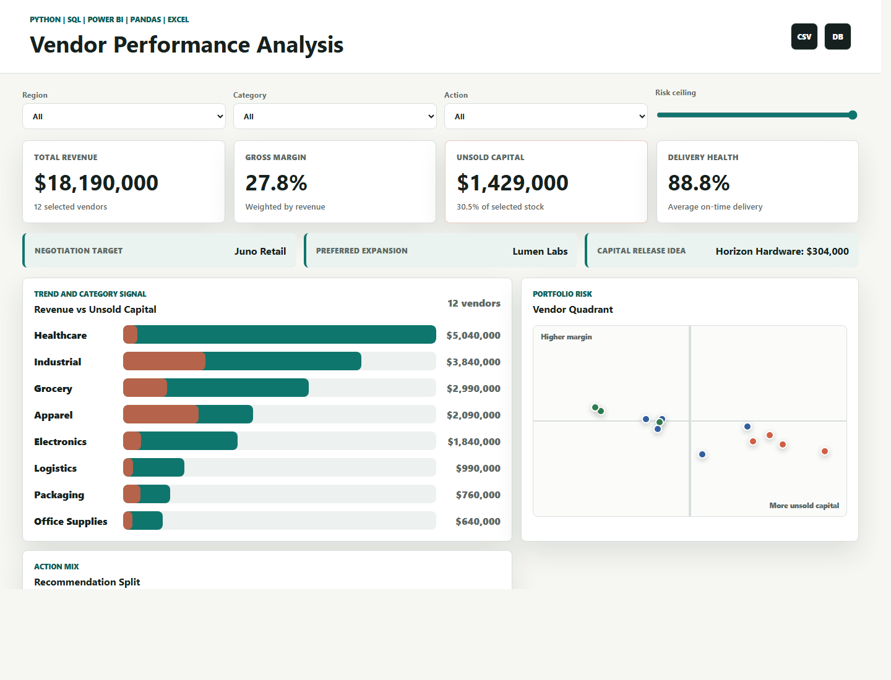
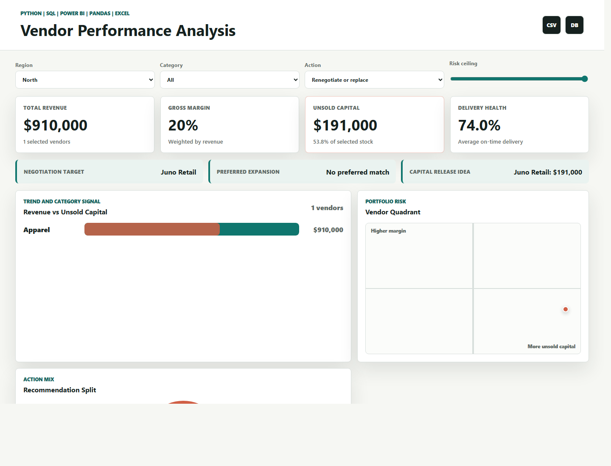

# Vendor Performance Analysis

End-to-end analytics project using SQL, Python EDA, Pandas, Excel-ready modeling, Power BI measure design, and a Vercel-ready interactive dashboard.

The project identifies vendor profitability, operational risk, unsold capital, category trends, and business actions such as reorder reduction, preferred vendor expansion, and renegotiation targets.

## Dashboard Screenshots





## What Makes It Useful

- Interactive Vercel dashboard with region, category, action, risk, and search filters.
- Automated vendor scoring for gross margin, sell-through, unsold stock exposure, and composite risk.
- Business recommendation engine: preferred vendor, monitor, reduce order quantity, or renegotiate/replace.
- SQL schema and analysis queries for BI warehouse workflows.
- Pandas EDA script that exports a stakeholder-ready Excel workbook.
- Power BI README with DAX measures and recommended dashboard pages.
- URL filter support for shareable dashboard views, for example `?region=North&recommendation=Renegotiate%20or%20replace`.

## Tech Stack

| Layer | Tools |
| --- | --- |
| Dashboard | HTML, CSS, JavaScript |
| Analytics | Python, Pandas |
| Data | CSV, Excel export |
| Warehouse | SQL |
| BI | Power BI DAX notes |
| Deployment | Vercel static output |

## Project Structure

```text
vendor-performance-analysis/
  app.js
  index.html
  styles.css
  data/
    vendor_performance.csv
    monthly_vendor_trends.csv
  sql/
    schema.sql
    analysis_queries.sql
  python/
    vendor_eda.py
    generate_dataset.py
  powerbi/
    README.md
  excel/
    README.md
  assets/screenshots/
  scripts/
    build.js
    dev-server.js
```

## Run Locally

```bash
cd vendor-performance-analysis
npm run dev
```

Open `http://localhost:5174`.

## Build for Vercel

```bash
cd vendor-performance-analysis
npm run build
```

This creates `vendor-performance-analysis/dist`.

The repository root also includes a `vercel.json`, so importing the repo into Vercel will build and serve this dashboard automatically.

## Python EDA

Install dependencies in your Python environment:

```bash
pip install pandas openpyxl
python python/vendor_eda.py
```

The script exports `excel/vendor_performance_model.xlsx` with a vendor scorecard, category summary, and region summary.

## Business Recommendations

- Renegotiate or replace vendors with low delivery performance and high composite risk.
- Reduce reorder volume where unsold stock is above 35 percent of inventory value.
- Expand preferred vendors that combine high on-time delivery with low defect rates.
- Track risk-weighted capital monthly to prevent slow-moving inventory from hiding inside revenue growth.
